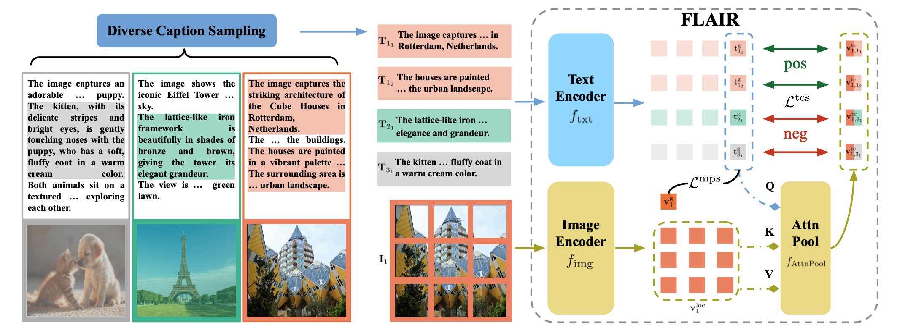

# [CVPR 2025] FLAIR: VLM with Fine-grained Language-informed Image Representations
[](https://arxiv.org/abs/2412.03561)
[](https://huggingface.co/xiaorui638/flair)


**Authors:** [Rui Xiao](https://www.eml-munich.de/people/rui-xiao), [Sanghwan Kim](https://kim-sanghwan.github.io/), [Mariana-Iuliana Georgescu](https://lilygeorgescu.github.io/), [Zeynep Akata](https://www.eml-munich.de/people/zeynep-akata), [Stephan Alaniz](https://www.eml-munich.de/people/stephan-alaniz)

## News
- **[2025-03-31]** 🍻 Check out [**COSMOS**](https://github.com/ExplainableML/cosmos), a self-distillation approach to be presented at **CVPR 2025**. 
- **[2025-03-02]** ⭐️ Training code & scripts released.
- **[2025-02-26]** 🎉 Our paper was accepted to **CVPR 2025**.
- **[2025-01-20]** ⭐️ Inference code & models released.

## Abstract
CLIP has shown impressive results in aligning images and
texts at scale. However, its ability to capture detailed visual features remains limited because CLIP matches images and texts at a global level. To address this issue, we propose **FLAIR**, **F**ine-grained **La**nguage-informed **I**mage
**R**epresentations, an approach that utilizes long and detailed image descriptions to learn localized image embeddings. By sampling diverse sub-captions that describe fine-grained details about an image, we train our vision-language model to produce not only global embeddings but also text-specific image representations. Our model introduces text-conditioned attention pooling on top of local image tokens to produce fine-grained image representations that excel at retrieving detailed image content. We achieve state-of-the-art performance on both, existing multimodal retrieval benchmarks, as well as, our newly introduced fine-grained retrieval task which evaluates vision-language models’ ability to retrieve partial image content. Furthermore, our experiments demonstrate the effectiveness of FLAIR trained on 30M image-text pairs in capturing fine-grained visual information, including zero-shot semantic segmentation, outperforming models trained on billions of pairs.

## Methodology


## Pre-trained Models

We released the pre-trained FLAIR models on [Huggingface](https://huggingface.co/xiaorui638/flair). The pre-trained models, their corresponding pre-trained datasets, and R@1 retrieval results on COCO and Flickr are listed below. For the full results please see the [paper](https://arxiv.org/pdf/2412.03561). Generally, FLAIR shares a similar architecture as the `ViT-B-16` model from [OpenCLIP](https://github.com/mlfoundations/open_clip), therefore also having similar number of parameters (150M vs 149M), the extra 1M parameters come from the text-conditioned attention pooling layer in FLAIR.

| **Checkpoints**                                                                                            | **Pre-trained Datasets** | **COCO T2I** | **COCO I2T** | **Flickr T2I** | **Flickr I2T** |
|------------------------------------------------------------------------------------------------------------|--------------------------|--------------|--------------|----------------|----------------|
| [flair-cc3m-recap](https://huggingface.co/xiaorui638/flair/resolve/main/flair-cc3m-recap.pt?download=true) | CC3M-recap               | 37.7         | 51.6         | 65.7           | 78.7           |
| [flair-cc12m-recap](https://huggingface.co/xiaorui638/flair/resolve/main/flair-cc12m-recap.pt?download=true) | CC12M-recap              | 47.8         | 64.1         | 75.4           | 90.8           |
| [flair-yfcc15m-recap](https://huggingface.co/xiaorui638/flair/resolve/main/flair-yfcc15m-recap.pt?download=true) | YFCC15M-recap            | 51.2         | 67.3         | 79.2           | 93.3           |
| [flair-merged30m](https://huggingface.co/xiaorui638/flair/resolve/main/flair-merged30m.pt?download=true)   | Merged30M                | 53.3         | 68.0         | 81.1           | 94.7           |


⚠️ You don't need to manually download the pre-trained weights to run the inference, the pre-trained weights will be automatically downloaded by specifying the `huggingface-model-name` in `src/inference.sh` (More details in the 'Inference with FLAIR' section). However, if you would like to store the pretrained weights despite the default path, you could download them manually and set  `--pretrained path/to/pretrained_weights` flag in `/src/inference.sh` instead (as OpenCLIP originally does).

## Dependencies
The following small tutorial helps you set up a simple python virtual environment to run our code. Since our main dependency is [OpenCLIP](https://github.com/mlfoundations/open_clip), which is still updated frequently, you could always check their repo for a detailed tutorial on creating an environment that is best suited for your system. A conda environment is also possible with the same Python and PyTorch version.
### 1. Create a Virtual Environment
First, navigate to the project’s root directory `flair/` and create a virtual environment using Python 3.12:
```bash
cd flair/
python3.12 -m venv flair_env
```
### 2. Activate and Navigate to src/
Activate the virtual environment and navigate to `src/`
```bash
source flair_env/bin/activate
cd src/
```

### 3. Install Dependencies
Our code mainly involves installing `open_clip_torch` and `open_clip_torch[training]`.
```bash
pip install --upgrade pip
pip install torch torchvision torchaudio --index-url https://download.pytorch.org/whl/cu124
pip install -r requirements.txt
```
The code is tested in Python 3.12 with PyTorch 2.5.1 with CUDA 12.4. Since [OpenCLIP](https://github.com/mlfoundations/open_clip) is quite dependency-friendly, we would assume other up-to-date versions should also work.

## Usage
A minimal usage of FLAIR is displayed in `src/minimal_example.py`, where we show that FLAIR has two ways of generating logits:
1. `model.get_logits()`: First query the local image tokens with the global text token using attention pooling, then compute the logits. This is the primary way of FLAIR getting the logits
2. `model.get_logits_as_clip()`: Without using attention pooling, directly compute the similarity between global-level image and text features.

Run the example by:
```bash
source flair_env/bin/activate
python3 src/minimal_example.py
```

## Inference Datasets Preparation
Check [EVAL_DATASETS.md](datasets/EVAL_DATASETS.md) to prepare all the inference datasets. For clarity, we provide an example datasets folder with annotation files in `datasets/`. However, all datasets don't have to be stored in the same directory, you could specify them freely by changing the arguments in `src/inference.sh`.

## Inference with FLAIR
To reproduce the retrieval results in the FLAIR paper, we provide an example inference bash script: `src/inference.sh`. Below are detailed explanations of important flags:

- `--huggingface-repo-name`: Name of the Huggingface repo where the pre-trained models are stored. Should be fixed as `'xiaorui638/flair'`.
- `--huggingface-model-name`: Name of the pretrained models. Options include:
  - `flair-cc3m-recap.pt`
  - `flair-cc12m-recap.pt`
  - `flair-yfcc15m-recap.pt`
  - `flair-merged30m.pt`
- `--inference-with-flair`: Enable this flag when using the FLAIR model.
- `--precision`: Fixed as `amp` in our paper.
- `--workers`: Adjustable according to your system.

The default `src/inference.sh` generate all text-conditioned image features for all the texts in the datatsets, which could result in longer inference time than the base CLIP model. To accelerate the inference, FLAIR also support top-k retrieval mode: For each image, FLAIR first uses global image-text matching to get the top-k texts, then uses text-conditioned attention pooling to generate conditioned image features ONLY among these top-k pairs. To use this mode for inference, please run `src/inference_topk.sh` with these flags:

- `--inference-with-flair-topk`: Enable this flag when using the FLAIR model in the top-k mode.
- `--topk`: it's recommended to set its value to be `128` or `256`.

FALIR also supports retrieval in the original CLIP's way by only matching the global image and text token. To use this mode for inference, please run `src/inference_global.sh` with the following flag. But please note that we did not use global matching to produce the results in our paper.

- `--direct-global-matching`: Enable this flag when using the FLAIR model in the global matching mode.

### Retrieval Tasks
Enable the following flags in `src/inference.sh` for different retrieval tasks:

1. **Standard Retrieval**
   - `--coco-data-root-dir`: Root directory of the COCO dataset.
   - `--flickr-data-root-dir`: Root directory of the Flickr30k dataset.
   - `--retrieval-coco`: Activate the COCO retrieval task.
   - `--retrieval-flickr`: Activate the Flickr retrieval task.
2. **Fine-grained Retrieval**
   - `--iiw-retrieval-dir`: Root directory of the Image-in-Words dataset.
   - `--docci-retrieval-dir`: Root directory of the DOCCI dataset.
   - `--retrieval-iiw`: Activate the Image-in-Words retrieval task.
   - `--retrieval-docci`: Activate the DOCCI retrieval task.
3. **Long Retrieval**
   - `--dci-retrieval-dir`: Root directory of the DCI dataset.
   - `--urban-1k-retrieval-dir`: Root directory of the Urban-1K dataset.
   - `--sharegpt4v-retrieval-dir`: Root directory of the ShareGPT4V dataset.
   - `--retrieval-dci`: Activate the DCI retrieval task.
   - `--retrieval-urban-1k`: Activate the Urban1K retrieval task.
   - `--retrieval-sharegpt4v-1k`: Activate the ShareGPT4V-1K retrieval task.
   - `--retrieval-sharegpt4v-10k`: Activate the ShareGPT4V-10K retrieval task.

## Training FLAIR
For results displayed in the main paper, FLAIR used [DreamLIP](https://github.com/ant-research/DreamLIP)'s recaptioned [CC3M-recap](https://huggingface.co/datasets/qidouxiong619/dreamlip_long_captions), [CC12M-recap](https://huggingface.co/datasets/qidouxiong619/dreamlip_long_captions), [YFCC15M-recap](https://huggingface.co/datasets/qidouxiong619/dreamlip_long_captions) and combined (Merged-30M). To verify that FLAIR is fit for various data distributions, FLAIR is also trained on the original [CC3M](https://huggingface.co/datasets/pixparse/cc3m-wds) and [PixelProse](https://huggingface.co/datasets/tomg-group-umd/pixelprose), results presented in the appendix of the paper. Notably, FLAIR requires all pre-training dataset to be processed into the [webdataset](https://github.com/webdataset/webdataset) format, to achieve higher I/O efficiency for large-scale training. In the pre-training dataset preparation step, we will take [CC3M-recap](https://huggingface.co/datasets/qidouxiong619/dreamlip_long_captions) as an example to demonstrate how to prepare the pretraining data. The preparation for other datasets should be similar.

### Prepare Pre-training Data
1. Download DreamLIP's annotations for CC3M-recap:
`wget https://huggingface.co/datasets/qidouxiong619/dreamlip_long_captions/resolve/main/cc3m_3long_3short_1raw_captions_url.csv`
2. Convert to `.parquet` format: `python3 /preprocess/convert_to_parquet.py --input-path /path/to/csv --output-path /path/to/parquet`
3. Scrape the images based on the url links using [img2dataset](https://github.com/rom1504/img2dataset), replace the paths accordingly:
`bash preprocess/scraping_cc3m.sh`
4. Now that the captions should be stored inside each shard with the `.json` format. We then pre-split all the captions and re-write the shards:
```python
python3 preproecss/presplit_captions.py --shards-dir /path/to/cc3m --num-processes 24 
```
**Remarks**: FLAIR requires the captions stored in `.json` format inside each shard, so that the captions can be handled by `sample_dict()` function in `src/flair/data.py`. Instead of pre-splitting captions in step 4, an alternative approach would be splitting the captions inside the `sample_dict()` function (see this [issue](https://github.com/ExplainableML/flair/issues/6)). 
To minimize loss of images, you could also download existing HuggingFace datasets to avoid the scraping in step 3. 

### Single-node training script
Users can find the single-node training script example `src/train_example.sh` in this repo, to test if the training runs. Important flags:
   - `--train-data`: Root dir of where the training data (shards) is stored.
   - `--train-num-samples`: In the example file we set it to `2823019` because that's the total number of image-text pairs we get in CC3M-recap. This should be adjustable based on your data.

The single-node training script `src/train_example.sh` has been tested to run without problems. We always recommend you to run your job on single node first before starting the multi-node training by:
```bash
source flair_env/bin/activate
bash src/train_example.sh
```

### Multi-node training script (Slurm)
In practice, FLAIR is trained with 8 NVIDIA A100s 40GB (on CC3M) or 32 NVIDIA A100s 40GB (on all larger datasets), where we finished all experiments using Slurm. In `src/`, we provide example slurm training scripts for each of the datasets, they are: `train_cc3m_slurm.sh, train_cc12m_slurm.sh, train_yfcc15m_slurm.sh, train_merged_30m_slurm.sh`. 

These training scripts contain all the necessary hyperparams you need to reproduce the training. However, you might need to add modifications to be able to run on your cluster. Please specify `--train-data` to be the directory storing the dataset shards and `--train-num-samples` to be the actual valid samples of that dataset. When training on the Merged-30M dataset, note that the `--train-data` should be the combination of the dataset paths of `cc3m-recap, cc12m-recap, yfcc15m-recap` separated by `::`, such as: 

`--train-data '/datasets/yfcc15m_recap/yfcc15m-train-{0000..3636}.tar::/datasets/cc12m_recap/cc12m-train-{0000..2175}.tar::/datasets/cc3m_recap/cc3m-train-{0001..0575}.tar'`

After configuring the Slurm scripts correctly, you could run the experiment by (taking CC3M-recap as an example):
```bash
source flair_env/bin/activate
sbatch src/train_cc3m_slurm.sh
```


## Acknowledgements
We thank [OpenCLIP](https://github.com/mlfoundations/open_clip) for providing the amazing code base. Meanwhile, we acknowledge [DreamLIP](https://github.com/zyf0619sjtu/DreamLIP) and [PixelProse](https://huggingface.co/datasets/tomg-group-umd/pixelprose) for providing us with various pre-training datasets with captions from MLLMs. We are also greateful for [LoTLIP](https://github.com/wuw2019/LoTLIP) for providing the the detailed scheme for long image-text retrieval task.

## Citations
If you find our work useful, please star this repo and cite:

```bibtex
@inproceedings{xiao2025flair,
  title={FLAIR: VLM with Fine-grained Language-informed Image Representations},
  author={Xiao, Rui and Kim, Sanghwan and Georgescu, Mariana-Iuliana and Akata, Zeynep and Alaniz, Stephan},
  booktitle={CVPR},
  year={2025}
}
```
